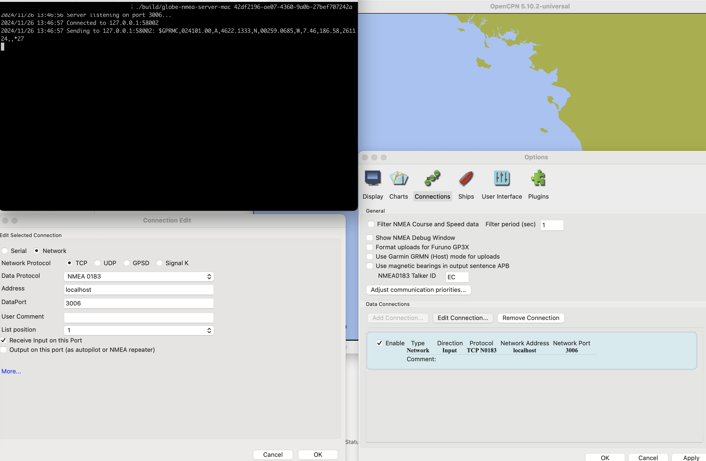

# Globe NMEA Server

## How to configure OpenCPN



Open Options, select Connections, Add Connection:

Network Connection
TCP
NMEA 0183
Address: localhost
DataPort: 3006

List position: 1
Receive Input on this Port ( ticked yes )

## Installation

Download latest release for your system:

https://github.com/marineverse/globe-nmea-server/releases 

### On Mac

#### Temporarily Bypass Gatekeeper

Locate the App:

Open Finder and navigate to the location of globe-nmea-server-mac.

Right-Click and Open

  - Right-click (or Control + click) on the app.


Select Open from the context menu.

Confirm:

  - A warning dialog will appear. Click Open to run the app.

This action will whitelist the app, and you won't see the warning again.

## Usage Windows:

Get your [BOAT_UUID] from https://www.marineverse.com/globe

1. Download globe-nmea-server.exe.
2. Right click on the file, ( Show More Options ) and create shortcut. 
3. Right click on the shortcut,  ( Show More Options ) and open Properties.
4. Modify "Target" by appending [BOAT_UUID] after globe-nmea-server.exe. It should be similar to: "globe-nmea-server.exe UUID-SDS-SDSSD-DSS".
5. Run the shortcut - the server should start ( You may need to select "Run anyway" and "Allow network connections" )


## Usage Mac:

Open TERMINAL app to get acccess to command line. 

Get your [BOAT_UUID] from https://www.marineverse.com/globe

```
~/Downloads/globe-nmea-server-mac [BOAT_UUID]
```
